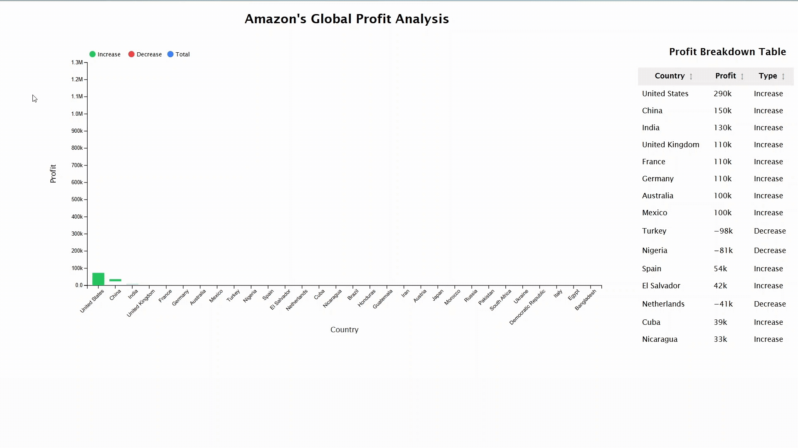

# 📊 Profit-Loss-Dashboard
An interactive data visualization project built with D3.js that transforms raw profit data into clear business insights. Features include a dynamic waterfall chart, sortable table with indicators (▲/▼), and interactive legends to filter increases/decreases. Designed to highlight key profit drivers, setbacks, and cumulative trends in a visually compelling way.

## 🌟 Overview  
The dashboard uses **d3.rollups** for efficient data aggregation and a **Waterfall Chart** to represent cumulative profit changes across countries. Combined with interactivity, sorting, and dynamic filtering, this visualization transforms complex data into clarity.  

---

## 🚀 Business Insights  

- **Key Profit Drivers**  
  The chart instantly highlights that the **United States, China, and India** are the foundational pillars of profitability, driving the majority of initial gains.  

- **Identifying Setbacks**  
  Specific markets like **Mexico and Turkey** are revealed as negative contributors, flagging areas for strategic review.  

- **The "Long Tail" of Success**  
  Despite some setbacks, dozens of countries provide smaller, consistent gains. This resilience keeps the overall trend positive.  

---

## 🛠️ Features  

- ✅ **Waterfall Chart** to visualize cumulative profit/loss  
- ✅ **Interactive Legends** (Increase / Decrease + Reset option)  
- ✅ **Sortable & Paginated Table** with ▲/▼ indicators  
- ✅ **Dynamic Filtering** to uncover trends at a glance  
- ✅ **Sequential Animations** (bars reveal one after another)  
- ✅ **Tooltip Breakdown** for precise profit/loss values  

---

## 🚀 How to Run
git clone https://github.com/sherryyy00/profit-loss-dashboard.git
cd profit-loss-dashboard

---

## 🎥 Demo Preview

---
## 🧠 Key Learnings

Using d3.rollups for data aggregation

Building a Waterfall Chart in D3.js

Leveraging scaleLinear for value-to-pixel mapping

Implementing tooltips, filtering, and sorting

Turning raw datasets into actionable insights

